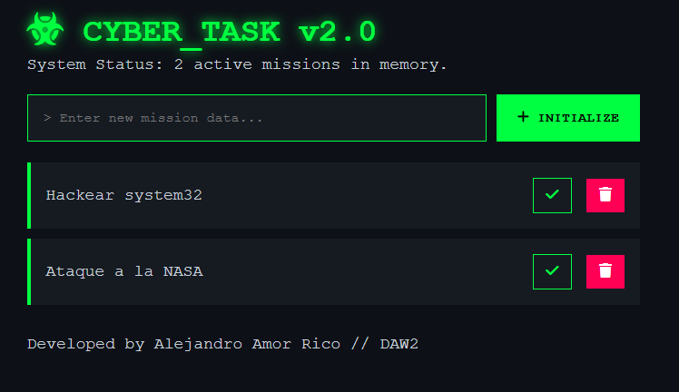

# ☣️ CYBER_TASK v2.0

> **System Status:** ONLINE  
> **Mission:** Task Management & Persistence

## 📄 Descripción / Description

**CYBER_TASK v2.0** es una aplicación web de gestión de tareas (To-Do List) desarrollada con una estética **Cyberpunk / Hacker Terminal**. 

Este proyecto de **DAW 2** demuestra el dominio de la manipulación del DOM, la persistencia de datos mediante **LocalStorage** y el diseño de interfaces modernas sin depender de frameworks externos. La aplicación simula una consola de sistema, ofreciendo feedback visual inmediato y alertas personalizadas.

## 🚀 Características / Features

* **Gestión de Estado (CRUD):** Añadir, listar, completar y eliminar misiones.
* **Persistencia Local:** Las tareas se guardan automáticamente.
* **Sistema de Alertas:** Ventana emergente (Modal) personalizada para errores.
* **Diseño Responsive:** Interfaz adaptable ("Mobile First").
* **UI Cyberpunk:** Modo oscuro con acentos verde neón.

## 🛠️ Tecnologías / Tech Stack

* **HTML5:** Estructura semántica con integración de iconos.
* **CSS3:** Estilos personalizados en `styles.css` (Variables, Flexbox, Modals).
* **JavaScript (ES6+):** Lógica en `app.js` para gestión del DOM y eventos.
* **Font Awesome:** Iconografía para elementos de interfaz (Biohazard, Trash, Check, etc.).

## 📸 Capturas / Screenshots



## 🔧 Instalación y Uso / Setup

1.  **Clonar el repositorio:**
    ```bash
    git clone [https://github.com/tu-usuario/cyber_task.git](https://github.com/tu-usuario/cyber_task.git)
    ```
2.  **Ejecutar:**
    Simplemente abre el archivo `index.html` en tu navegador web. No requiere servidor ni instalación de dependencias.

## 📂 Estructura del Proyecto

```text
CYBER_TASK/
├── index.html      # Estructura principal y Modal HTML
├── styles.css      # Hoja de estilos (Tema oscuro y Modal)
├── app.js          # Lógica de negocio y LocalStorage
└── README.md       # Documentación del proyecto